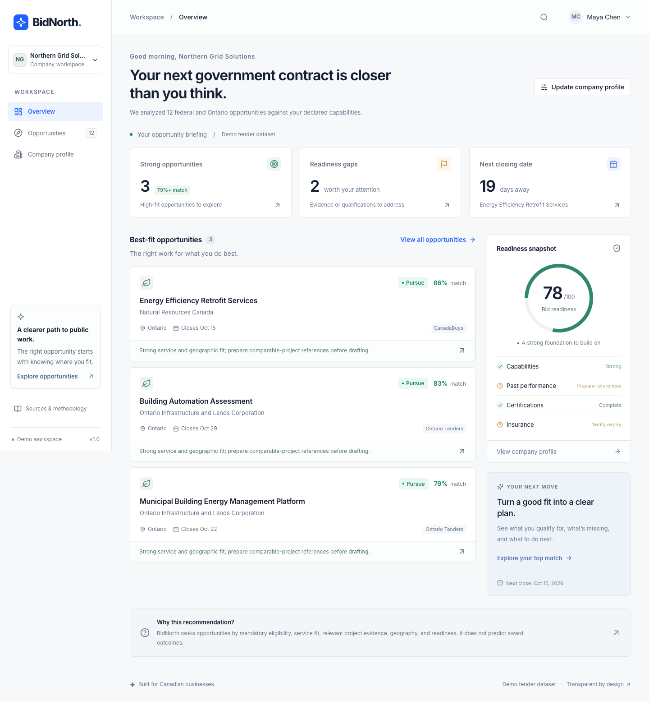

# BidNorth

**Find government contracts your business can actually pursue.**

BidNorth is an explainable procurement co-pilot for Canadian small businesses. It turns a company profile and a curated tender record into a concrete decision: **Pursue, Partner, or Pass**—with the requirements, evidence gaps, and next steps behind that recommendation.



## Why it matters

Public procurement can give Canadian SMEs a durable source of customers and growth. Long solicitations, unfamiliar qualification rules, and limited bid-writing capacity make that market difficult to navigate. BidNorth helps owners focus their time on relevant work, prepare stronger evidence, and see when a specialist partner is needed.

It supports the decision to bid. It does not predict who will win or submit bids.

## Run locally

Requires **Node.js 20.9 or newer** (Node 22 recommended) and npm.

```bash
npm install
npm run dev
```

Open [localhost:3000](http://localhost:3000). No account, database, or API key is needed. The default workspace is Northern Grid Solutions, an illustrative 18-person Ontario company.

For a production build:

```bash
npm run build
npm start
```

### Optional live Bid Coach

```bash
cp .env.example .env.local
```

Set `OPENAI_API_KEY` in `.env.local`, then restart the server. The server calls **`gpt-6-astra` through OpenAI’s Responses API** using strict JSON-schema output, a 12-second timeout, and `store: false`. Refreshing the coach sends the company profile and the canonical demo tender to OpenAI when the key is configured. Initial guidance is local and deterministic; opening a page does not trigger a model request.

The key stays on the server. `.env.local` is excluded from Git. Never prefix the key with `NEXT_PUBLIC_`. If the key is absent, the model is unavailable, a request times out, or its output fails validation, the app returns useful profile-based guidance with an explicit fallback label.

Implementation references: [OpenAI structured outputs](https://developers.openai.com/api/docs/guides/structured-outputs) and [GPT-6 Astra](https://developers.openai.com/api/docs/models/gpt-6-astra).

## Demo walkthrough

1. **Overview** — see three strong opportunities and a 78/100 profile-readiness snapshot.
2. Open **Energy Efficiency Retrofit Services** — an 86% Pursue assessment, five referenced requirements, evaluation priorities, concrete reasons, and a checklist.
3. Choose **Generate bid plan** — review four phases, then copy the formatted plan to the clipboard. Escape closes the drawer and restores focus.
4. Choose **Refresh analysis** — receive live AI coaching when configured, or deterministic guidance without a key.
5. Visit **Company profile** — remove Ontario coverage or a mandatory qualification, save, and see the top tender change to Pass. Restore coverage and mark the first two project references ready to improve the score.
6. Browse **Opportunities** — search, combine Source/Sector/Location/Decision filters, sort, and inspect the methodology.

The optional proposal-readiness panel checks a short excerpt locally for drafting cues. Its output is labeled as a simulated review, not verified compliance or a document analysis service.

## Matching methodology

`calculateMatch(company, tender)` in `src/lib/matching.ts` is a pure function. There are no stored match scores, tender-specific score overrides, or hidden model judgments.

| Dimension        | Weight | Inputs                                                                                                                                           |
| ---------------- | -----: | ------------------------------------------------------------------------------------------------------------------------------------------------ |
| Service fit      |    35% | 75% direct capability overlap and 25% keyword overlap across capabilities/project tags                                                           |
| Eligibility      |    30% | Mandatory requirements: verified earns 100, needs evidence 70, not met 0; averaged                                                               |
| Project evidence |    20% | Comparable projects, with 62% credit for a description and 100% for a prepared reference; only the required number of best references count      |
| Operational fit  |    15% | Declared geography (65 points), team size relative to the tender’s illustrative delivery-team indicator (25), and named procurement contact (10) |

Dimensions are rounded to whole numbers before their weighted total is rounded. The top opportunity has **94 service / 93 eligibility / 62 evidence / 86 operational**, producing **86 overall**. Unlike the brief’s illustrative metric bars, these values reconcile with the specified scoring weights.

Decision rules, in order:

- **Pass:** any clearly unmet mandatory requirement, or total below 45.
- **Partner:** 45–69, or a declared specialist partnership gap with service fit below 80.
- **Pursue:** 70+ without the preceding blockers or strategic gap.

“Needs evidence” means a profile assertion lacks ready supporting material. A missing qualification, insufficient insurance limit, insurance expiring before closing, or missing mandatory delivery region is “Not met.” “Verified” means matched against the company’s declared demo profile, **not independently verified**. Insurance must still be checked against the full contract period and policy scope.

Related project tags and client context guide selection; reference readiness is declared by the user. The engine does not validate uploaded certificates or contact references. Input validation limits profile size, the API resolves the tender from the local dataset, and it recomputes the match rather than trusting browser-supplied requirements or scores.

### Dashboard interpretation

- **Strong opportunities** means Pursue with a score of **79+**. The default company has three, while six of the twelve opportunities qualify as Pursue overall.
- The separate **profile readiness** score measures profile completeness: capabilities 30, project descriptions/references 40, qualifications 20, and populated insurance details 10. An unconfirmed project description earns 45% of its profile-evidence credit. It is not the same score as a tender match.
- **Readiness gaps** flags missing comparable references and the remaining insurance-document review.
- Deadline countdowns use the actual UTC date, not a fixed demo clock. Internal review dates fall two days before the illustrative closing date. A past closing date is labeled Closed; scores continue to describe fit, not whether a notice is still open.
- Action checkboxes are session-local; saved profile edits persist in this browser’s local storage. Corrupt or unavailable storage falls back safely. Local storage can be cleared to restore the default company.

## Data and sources

**This is a Demo tender dataset, not live government data.** The 12 opportunities are illustrative records curated for this brief and modeled on public procurement notice structures. Titles, buyer associations, dates, tender numbers, source-section references, requirements, and weights are not verified live solicitations. No tender scraping or portal login occurs.

Each record points to the relevant official portal:

- [CanadaBuys tender opportunities](https://canadabuys.canada.ca/en/tender-opportunities)
- [Ontario Tenders](https://ontariotenders.app.jaggaer.com/)

These are **portal entry points**, not links to matching live records. “Dataset prepared” identifies the demo preparation date; it does not claim a notice-access date. Always verify the official procurement documents, amendments, closing time, and submission process. The pre-filled company, project outcomes, insurance limit, and credentials are also demo content.

## Technology and structure

Next.js 15 App Router, React 19, strict TypeScript, Tailwind CSS 4 plus custom design tokens, Lucide icons, locally bundled Inter through `next/font/local`, and Zod validation. CSS handles subtle transitions and honors reduced-motion preferences. Native dialogs provide focus management, Escape handling, and clipboard export.

```text
src/app/                 Routes, root layout, design system styles
src/app/api/bid-coach/   Server-only OpenAI request boundary
src/components/         Workspace shell, profile form, analysis and coaching UI
src/data/               Typed company profile and 12 illustrative tenders
src/lib/                Pure matching, plans, validation, dates, coach service
src/types/              Shared procurement types
tests/                  Matching and API contract tests
tests/e2e/              Browser workflow and responsive checks
docs/                   Verified application screenshots
```

No database, authentication, payments, uploads, external assets, vector search, or background jobs are required. There are no analytics or tracking integrations in the application.

## Verification

```bash
npm test
npm run typecheck
npm run build
npm run test:e2e
```

Browser tests use installed **Google Chrome** through Playwright’s `chrome` channel and automatically start or reuse a development server at port 3000. Run the fallback browser tests without `OPENAI_API_KEY`. Screenshots are generated under `test-results/screenshots/` at **1440, 768, and 390 pixels**. If Chrome is not installed, install it or switch `channel` in `playwright.config.ts` to an installed Playwright browser.

Coverage includes all twelve expected default scores/decisions, mandatory blockers, insurance checks, profile-driven recomputation, pure-function invariants, prepared-reference credit, API input validation, structured output, refusals/errors/timeouts, search and filters, sorting, profile persistence, copy-to-clipboard, drawer focus, responsive overflow, proposal review, and unknown routes.

The configured-model success path is verified with a mocked Responses API response. **A real paid OpenAI call has not been exercised in this workspace because no API key is configured.**

## Limits and responsible use

> BidNorth assesses fit and bid readiness using the information in your profile and the tender record. It does not predict award outcomes or replace review of the original procurement documents.

This is a local hackathon demo. It has no authentication or distributed rate limiting and should not be exposed as a public paid-AI endpoint without deployment safeguards. It does not submit bids or offer legal assurance. A person must verify the complete source documents and make the final procurement decision.
